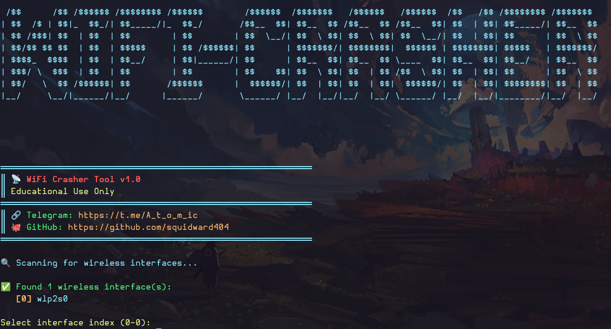

# 📡 WiFi Crasher Tool v1.0

<div align="center">


> 🔒 **Wireless Network Auditing Tool for Educational & Security Research Purposes**

[Features](#-features) • [Installation](#-installation) • [Usage](#-usage-guide) • [Requirements](#-requirements)

</div>

---

<div align="center">

</div>

---

## 📖 Overview

WiFi Crasher Tool is a **Python-based wireless security auditing suite** designed for ethical hackers, security researchers, and network administrators. It automates the process of scanning wireless networks, analyzing signal strength, and performing deauthentication tests using the industry-standard `aircrack-ng` suite.

### ⚠️ Important Notice

> **This tool is for EDUCATIONAL PURPOSES ONLY.**
> 
> Only use on networks you **OWN** or have **EXPLICIT WRITTEN PERMISSION** to test. Unauthorized use may violate federal and local laws.

---

## ✨ Features

| Feature | Description |
|---------|-------------|
| 🎨 **Colorful UI** | Beautiful terminal interface with ANSI colors and real-time updates |
| 📡 **Auto Detection** | Automatically detects WiFi interfaces (wlan0, wlp2s0, wlx...) |
| 🔍 **Live Scanning** | Real-time network discovery with signal strength analysis |
| 📊 **Signal Coloring** | Visual indicators: 🟢 Strong | 🟡 Medium | 🔴 Weak |
| 🔒 **Monitor Mode** | Automatic monitor mode enablement with conflict resolution |
| 🎯 **Target Selection** | Easy menu-based network selection |
| ⚡ **Deauth Testing** | Continuous deauthentication packet testing |
| 💾 **Auto Backup** | Automatic CSV backup before each scan session |
| 🛡️ **Process Management** | Kills conflicting processes automatically |

---

## 📋 Requirements

### Hardware Requirements

| Component | Requirement |
|-----------|-------------|
| **WiFi Adapter** | Must support **Monitor Mode** & **Packet Injection** |
| **Recommended** | Alfa AWUS036NHA, AWUS036ACH, TP-Link TL-WN722N (v1) |
| **RAM** | Minimum 2GB |
| **Storage** | 100MB free space |

### Software Requirements

| OS | Required Packages |
|----|-------------------|
| **Linux** | `aircrack-ng`, `wireless-tools`, `iw`, `rfkill`, `python3` |
| **macOS** | `homebrew`, `aircrack-ng`, `python3` |
| **Windows** | **WSL2** recommended, or native Python 3.8+ |

> ⚠️ **Note:** Windows users should use **WSL2 (Windows Subsystem for Linux)** for full compatibility. Native Windows support is limited due to driver restrictions.

---

## 🚀 Installation

🐧 Linux (Ubuntu/Debian/Zorin/Kali)

```bash
# 1. Update package list
sudo apt update

# 2. Install required packages
sudo apt install -y python3 python3-pip aircrack-ng wireless-tools iw rfkill

# 3. Clone the repository
git clone https://github.com/squidward404/wifi-crasher.git
cd wifi-crasher

# 4. Make executable (optional)
chmod +x wifi-crasher.py

# 5. Run the tool
sudo python3 wifi-crasher.py
```
🍎 macOS
```
# 1. Install Homebrew (if not installed)
/bin/bash -c "$(curl -fsSL https://raw.githubusercontent.com/Homebrew/install/HEAD/install.sh)"

# 2. Install required packages
brew install python3 aircrack-ng

# 3. Clone the repository
git clone https://github.com/squidward404/wifi-crasher.git
cd wifi-crasher

# 4. Run the tool
sudo python3 wifi-crasher.py
```
🪟 Windows (WSL2 Recommended)
```
# 1. Install WSL2 (Windows Subsystem for Linux)
# Open PowerShell as Administrator and run:
wsl --install

# 2. Restart your computer, then open WSL (Ubuntu)

# 3. Update and install packages
sudo apt update
sudo apt install -y python3 python3-pip aircrack-ng wireless-tools iw rfkill

# 4. Clone the repository
git clone https://github.com/squidward404/wifi-crasher.git
cd wifi-crasher

# 5. Run the tool
sudo python3 wifi-crasher.py
```
📖 Usage Guide
```
# 1. Navigate to the tool directory
cd wifi-crasher

# 2. Unblock WiFi (if needed)
sudo rfkill unblock all

# 3. Run with sudo privileges
sudo python3 wifi-crasher.py
